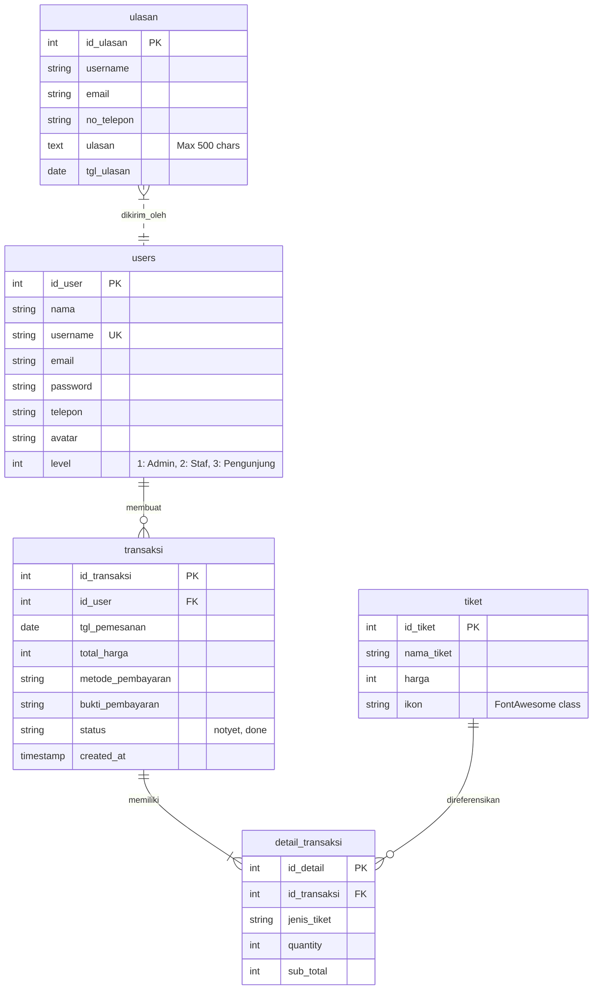

# Sistem Informasi Kasir & Reservasi Wisata Pemandian Patemon
### UPTD Pariwisata & Kebudayaan Kabupaten Jember

[](https://php.net)
[](https://mysql.com)
[](https://github.com/Aiyub150/SIM-ASET)
[](https://github.com/Aiyub150/aplikasi-kasir-dan-portofolio-pemandian-patemon)

---

## 🏛️ Ringkasan Eksekutif

**Sistem Informasi & Kasir Loket Pemandian Patemon** adalah platform tata kelola terpadu untuk destinasi wisata mata air alami Pemandian Patemon, Kecamatan Tanggul, Kabupaten Jember. Sistem ini menggabungkan landing page profil publik, sistem reservasi tiket online pengunjung, *Point of Sale* (POS) loket kasir, validasi barcode tiket masuk, laporan pendapatan terstandarisasi Pemerintah Kabupaten (Pemkab) Jember, serta kalender prediksi wisatawan berbasis API Hari Libur Nasional.

Arsitektur aplikasi ini dibangun dan disempurnakan dengan mengadopsi standar tata kelola instansi pemerintah lokal berbasis **[Aiyub150/SIM-ASET](https://github.com/Aiyub150/SIM-ASET)** (Sistem Manajemen Aset Daerah Pemda Jember), menghasilkan tata kelola kasir yang akuntabel, transparan, dan siap audit.

---

## 📐 Arsitektur Sistem & Prinsip Desain

```
[ Klien / Browser ]
         │
         ▼
[ .htaccess (Apache) / router.php (PHP CLI) ] ── (Clean URL Rewriting & Path Shielding)
         │
         ▼
[ dist/app/config.php ] ── (DB Connection, CSRF, RBAC Auth, Security Headers, Helpers)
         │
         ├───► [ Landing Page & Pemesanan ] ──► (index.php, pesan.php, nota.php)
         │
         └───► [ Admin & Kasir POS Panel ]
                    │
                    ├── dist/app/layouts/admin_header.php (Universal Topbar & Sidebar)
                    ├── dist/views/{dashboard, transaksi, tiket, user, ulasan, profile, settings}/
                    └── dist/app/layouts/admin_footer.php (Search, Scripts, Analytics)
```

### 1. Pola Master Layout (`DRY` Principle)
Sebelumnya, kode sidebar, header, topbar, dan footer diduplikasi pada lebih dari 20 berkas view. Seluruh modul administrasi kini menggunakan arsitektur **Master Layout**:
- `dist/app/layouts/admin_header.php`: Menyediakan dokumen HTML standar, session checks, topbar dinamis, dan role badge.
- `dist/app/layouts/admin_footer.php`: Menyediakan modal scripts, filter table search universal, dan chart bundle.

### 2. Clean URL Routing Engine
Pengguna dan petugas tidak lagi melihat path internal seperti `/dist/views/transaksi/transaksi.php`. Seluruh rute dipetakan secara bersih:
- **Lingkungan Apache / XAMPP**: Dikelola melalui `.htaccess` dengan modul `mod_rewrite` aktif.
- **Lingkungan Built-in Server**: Dikelola melalui `router.php` dan `serve.php` dengan penanganan `chdir(dirname($targetFile))` untuk menjamin kompatibilitas require relatif.

---

## 🗺️ Peta Rute URL Bersih (Clean Routes Table)

| Clean URL | Target File | Metode | Hak Akses | Deskripsi Fungsi |
| :--- | :--- | :--- | :--- | :--- |
| `/` | `dist/views/index.php` | `GET, POST` | Publik | Landing page, tarif, fasilitas, dan form ulasan |
| `/login` | `dist/views/login.php` | `GET, POST` | Tamu | Autentikasi akun staf, admin, dan pengunjung |
| `/register` | `dist/views/register.php` | `GET, POST` | Tamu | Pendaftaran akun pengunjung baru |
| `/logout` | `dist/views/logout.php` | `GET` | Autentikasi | Terminasi sesi aman & redirect |
| `/tiket/pesan` | `dist/views/tiket/pesan.php` | `GET, POST` | Pengunjung/Staf | Reservasi tiket online, QRIS, & Transfer |
| `/tiket/nota` | `dist/views/tiket/nota.php` | `GET` | Pemilik/Petugas | Struk barcode tiket & cetak voucher |
| `/dashboard` | `dist/views/dashboard/dashboard.php` | `GET` | Admin (Lvl 1) | Omzet, grafik, kalender Kemendesa, & quick cards |
| `/admin/transaksi` | `dist/views/transaksi/transaksi.php` | `GET` | Admin/Staf | Kelola transaksi kasir, search multi-field, & filter |
| `/admin/tiket` | `dist/views/tiket/tiket.php` | `GET` | Admin (Lvl 1) | Manajemen kategori tiket & tarif harga masuk |
| `/admin/users` | `dist/views/user/user.php` | `GET` | Admin (Lvl 1) | Manajemen akun administrator, kasir, & pengunjung |
| `/admin/ulasan` | `dist/views/ulasan/ulasan.php` | `GET` | Admin (Lvl 1) | Moderasi kritik, saran, & popup baca lengkap |
| `/kasir` | `dist/views/transaksi/staf.php` | `GET` | Admin/Staf | POS loket, scan barcode kamera, & rekap kas harian |
| `/laporan/harian` | `dist/views/transaksi/laporan_harian.php` | `GET` | Admin/Staf | Rekap penerimaan tiket per hari |
| `/laporan/bulanan` | `dist/views/transaksi/laporan_bulanan.php` | `GET` | Admin/Staf | Rekap penerimaan tiket per bulan |
| `/laporan/tahunan` | `dist/views/transaksi/laporan_tahunan.php` | `GET` | Admin/Staf | Rekap evaluasi omzet tahun berjalan |
| `/laporan/preview` | `dist/views/transaksi/laporan_preview.php` | `GET` | Admin/Staf | Format Resmi Pemkab Jember (Kop, Terbilang, TTD) |
| `/profile` | `dist/views/profile/profile.php` | `GET, POST` | Autentikasi | Profil akun, nomor HP, & ganti password |
| `/settings/version` | `dist/views/settings/version.php` | `GET` | Autentikasi | Info rilis, spesifikasi server, & status keamanan |
| `/guide` | `dist/views/settings/guide.php` | `GET` | Autentikasi | Panduan operasional sistem & SOP kasir |
| `/guide/preview-pdf` | `dist/views/settings/guide_preview_pdf.php` | `GET` | Autentikasi | Pratinjau interaktif buku panduan cetak PDF |

---

## 🗄️ Spesifikasi Skema Database (MySQL / MariaDB)

Basis data `pemandian` terdiri dari 5 entitas utama yang saling berelasi:



### Kamus Data Entitas
1. **`tiket`**: Menyimpan kategori tiket masuk (`Dewasa`, `Anak-Anak`, `Lansia`, dsb.), harga, serta kelas ikon FontAwesome dinamis (misal: `fa-person`, `fa-child`, `fa-person-cane`).
2. **`transaksi`**: Header transaksi penjualan tiket kasir/online. Nomor referensi standar diformat secara terprogram menjadi `TRX-YYYYMMDD-XXXX`.
3. **`detail_transaksi`**: Menyimpan rincian tiket yang dipesan (kuantitas dan subtotal), mencegah hardcoding jenis tiket.
4. **`users`**: Tabel pengguna dengan Role-Based Access Control (RBAC): Level 1 (Administrator), Level 2 (Staf Kasir Loket), Level 3 (Pengunjung).
5. **`ulasan`**: Menampung kritik dan saran pengunjung dengan batas 500 karakter dan sanitasi XSS.

---

## 🛡️ Standar Keamanan & Perlindungan Data

Aplikasi ini mengimplementasikan prinsip *defense-in-depth* untuk melindungi data instansi:

1. **Prepared Statements (SQL Injection Defense)**:
   Seluruh query interaktif yang melibatkan input pengguna (GET/POST) menggunakan PDO/MySQLi Prepared Statements dengan *parameter binding* eksplisit.
2. **CSRF (Cross-Site Request Forgery) Tokens**:
   Setiap formulir POST (pemesanan tiket, ulasan, update profil, manajemen user, dsb.) diverifikasi menggunakan token kriptografis berbasis sesi `validate_csrf()`.
3. **Session Hijacking & Fixation Defense**:
   - `session_regenerate_id(true)` dipanggil setiap kali terjadi autentikasi login atau peningkatan hak akses.
   - Sesi memeriksa `User-Agent` dan menerapkan timeout otomatis.
4. **Anti-Tampering Pricing**:
   Kalkulasi total tagihan tiket selalu dihitung ulang di sisi server (`server-side authoritative pricing`) berdasarkan tarif resmi di database, bukan mempercayai nilai yang dikirim dari klien.
5. **Validasi File Upload Bukti Transfer**:
   Pemeriksaan ketat terhadap berkas bukti pembayaran mencakup: ekstensi (`jpg, jpeg, png, webp`), MIME type riil via PHP `finfo`, batas ukuran maksimal 2 MB, dan penamaan ulang dengan token acak aman.
6. **Path Traversal & Direct File Access Blocking**:
   Konfigurasi `.htaccess` secara otomatis menolak akses publik ke berkas sensitif (`.env`, `.git`, `.sql`, `composer.json`, `composer.lock`, `.md`).

---

## 💳 Strategi Pembayaran & Dynamic Gateway

Sistem menyediakan 3 opsi pembayaran terpisah yang transparan:
1. **Bayar di Loket (Tunai)**: Pengunjung memesan tiket secara online lalu melakukan pembayaran tunai langsung di kasir loket saat tiba di lokasi.
2. **Scan QRIS**: Menampilkan kartu QRIS statis berstandar nasional dengan nama merchant resmi "UPTD Pemandian Patemon - Pemkab Jember", NMID, petunjuk scan m-Banking/e-Wallet, dan dropzone upload bukti pembayaran.
3. **Transfer Bank Resmi**: Menampilkan informasi rekening resmi Kas Daerah/UPTD (Bank Jatim / Mandiri / BCA), nomor rekening, nama pemilik rekening, tombol salin nomor rekening interaktif, dan upload bukti transfer.

### Aktivasi Dynamic Payment Gateway (Modular)
Arsitektur pembayaran telah dirancang modular. Pengembang dapat mengintegrasikan *Payment Gateway* otomatis (Midtrans Snap, Xendit, atau Duitku) tanpa merombak basis kode:
1. Buka berkas `dist/app/config.php`.
2. Aktifkan konstanta:
   ```php
   define('FEATURE_PAYMENT_GATEWAY', true);
   ```
3. Konfigurasi kredensial gateway pada environment/config, dan implementasikan handler Snap Token yang telah disediakan di `dist/views/tiket/pesan.php`.

---

## 🏛️ Kepatuhan Standar Pemkab Jember (SIM-ASET Standard)

Merujuk pada implementasi tata kelola aset daerah di **[Aiyub150/SIM-ASET](https://github.com/Aiyub150/SIM-ASET)**:
- **Kop Surat Kedinasan Ganda**: Menampilkan lambang resmi Pemerintah Kabupaten Jember, Dinas Pariwisata dan Kebudayaan, serta UPTD Pengelola Objek Wisata Patemon.
- **Konversi Terbilang Otomatis**: Angka penerimaan kas dikonversi menjadi kalimat terbilang rupiah baku (misal: *"Dua Ratus Lima Puluh Ribu Rupiah"*).
- **Legalisasi & Tanda Tangan Ganda**: Lembar laporan memuat tanda tangan mengetahui Kepala UPTD Pemandian Patemon (dengan NIP) dan Bendahara Penerimaan / Kasir Loket.
- **Pratinjau Interaktif Sebelum Cetak**: Tombol cetak mengarahkan admin/staf ke halaman pratinjau dokumen resmi (`/laporan/preview`) sebelum dialog cetak browser atau ekspor PDF dijalankan.
- **Kalender Libur Nasional (Kemendesa API)**: Dashboard admin menampilkan data hari libur nasional riil berbasis SKB 3 Menteri RI secara otomatis dengan *24-hour file cache* untuk membantu perencanaan staf loket saat *high season* dan *long weekend*.

---

## 🚀 Panduan Instalasi & Menjalankan Aplikasi

### Kebutuhan Sistem (Prerequisites)
- PHP versi **8.1** atau yang lebih baru (ekstensi `mysqli`, `fileinfo`, `gd`, `mbstring`, `curl` aktif)
- MySQL **8.0+** atau MariaDB **10.4+**
- Composer package manager (opsional untuk dependensi vendor)

### Langkah-Langkah Pemasangan

#### 1. Kloning Repositori
```bash
git clone https://github.com/Aiyub150/aplikasi-kasir-dan-portofolio-pemandian-patemon.git
cd aplikasi-kasir-dan-portofolio-pemandian-patemon
```

#### 2. Instalasi Dependensi Composer
```bash
composer install --no-dev --optimize-autoloader
```
*Dependensi terinstal meliputi `dompdf/dompdf` untuk generasi PDF dan `picqer/php-barcode-generator` untuk barcode nota.*

#### 3. Setup Basis Data MySQL
1. Buat database baru bernama `pemandian` di MySQL / phpMyAdmin.
2. Impor berkas skema yang telah diperbarui:
   ```bash
   mysql -u root -p pemandian < database/pemandian.sql
   ```
3. Sesuaikan koneksi di `dist/app/config.php` jika menggunakan host, port, atau kata sandi berbeda:
   ```php
   $host = "127.0.0.1";
   $user = "root";
   $pass = "";
   $db   = "pemandian";
   $port = 3306;
   ```

#### 4. Menjalankan Server Lokal

**Opsi A: Menggunakan PHP Built-in Server (Sangat Direkomendasikan)**
```bash
php serve.php
```
*Aplikasi akan berjalan di `http://127.0.0.1:8000` dengan dukungan Clean Routing.*

**Opsi B: Menggunakan Apache (XAMPP / Laragon)**
1. Letakkan folder proyek di `C:\xampp\htdocs\pemandian-patemon`.
2. Pastikan ekstensi `mod_rewrite` aktif pada konfigurasi Apache `httpd.conf`.
3. Buka browser pada alamat `http://localhost/pemandian-patemon`.

---

## 🔑 Kredensial Pengujian Bawaan

| Role | Username | Password | Hak Akses |
| :--- | :--- | :--- | :--- |
| **Administrator** | `admin` | `password` / `admin` | Seluruh Modul, Master User, Tarif, & Laporan |
| **Staf Kasir Loket** | `kasir` | `password` / `kasir` | POS Kasir Loket, Validasi Nota, Scan Barcode |
| **Pengunjung** | `pengunjung` | `password` | Pemesanan Tiket Online & Riwayat Nota |

---

## 📦 Pustaka & Komponen Pihak Ketiga

- **UI & CSS**: Bootstrap 5.2.3, FontAwesome 6.4.0, CSS Variables Modern Design System
- **Rendering PDF**: [dompdf/dompdf](https://github.com/dompdf/dompdf) v3.0
- **Barcode Engine**: [picqer/php-barcode-generator](https://github.com/picqer/php-barcode-generator) v2.4 (Code 128)
- **Kamera Scanner**: [html5-qrcode](https://github.com/mebjas/html5-qrcode) (Client-side QR & Barcode reader)
- **Grafik & Visualisasi**: Chart.js v4.4.0
- **Kalender Hari Libur**: API Terbuka Hari Libur Nasional (Kemendesa / Kemenko PMK SKB 3 Menteri)

---

## 👨‍💻 Maintainer & Lisensi

- **Lead Developer**: [Aiyub150](https://github.com/Aiyub150)
- **Instansi Pengampu**: UPTD Pemandian Patemon, Dinas Pariwisata dan Kebudayaan Kabupaten Jember
- **Lisensi**: Proyek ini dikembangkan di bawah lisensi institusional untuk pemanfaatan pelayanan publik pariwisata daerah.
