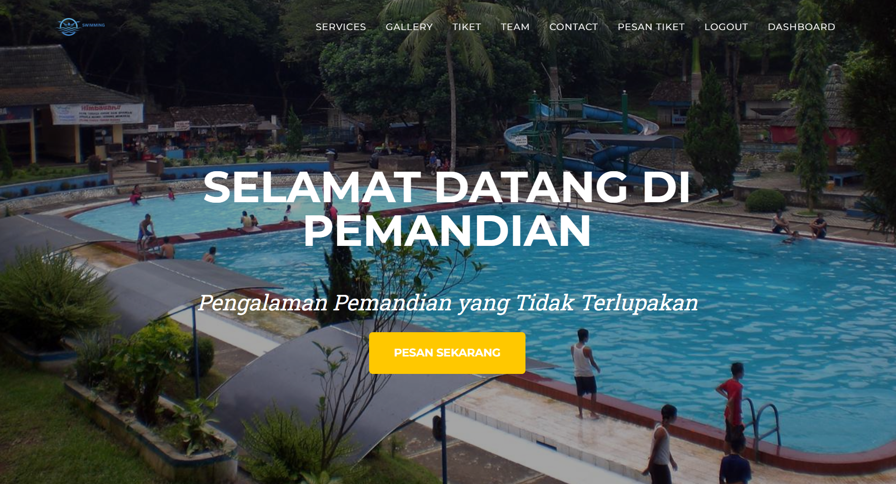
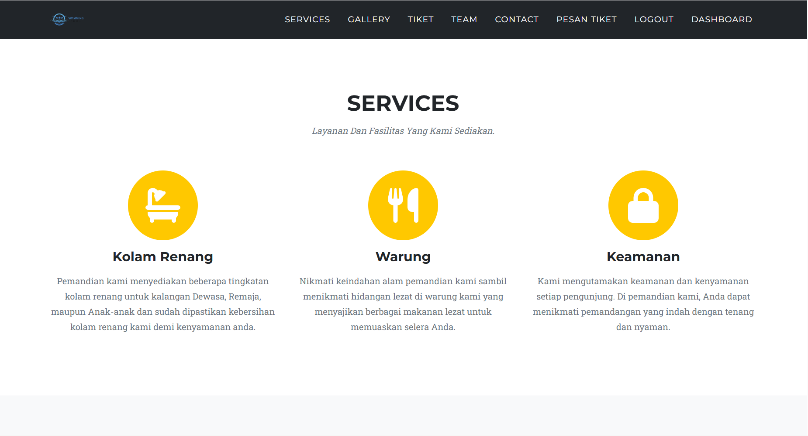
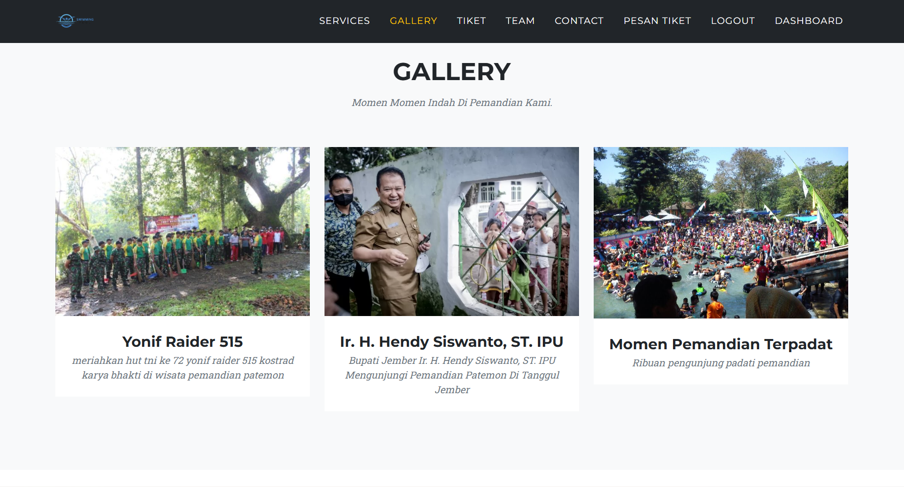
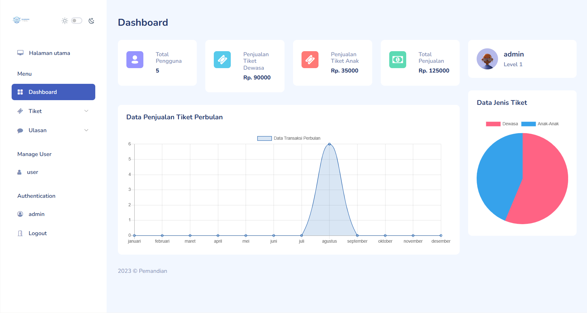

# Aplikasi Kasir dan Portofolio Pemandian Patemon


## 📌 Deskripsi Proyek
**Aplikasi Kasir dan Portofolio Pemandian Patemon** adalah sistem berbasis web terpadu yang dirancang khusus untuk objek wisata mata air Pemandian Patemon di Tanggul, Jember. Aplikasi ini memiliki fungsi ganda: sebagai **web portofolio/profil** yang menampilkan informasi layanan, galeri, dan pemesanan tiket untuk pengunjung, serta sebagai **sistem kasir/dashboard admin** untuk mengelola data penjualan tiket, statistik keuangan per bulan, dan manajemen pengguna secara *real-time*.

---

## 🌟 Fitur Utama & Tampilan Antarmuka (Preview)

Berikut adalah pratinjau tampilan dari berbagai halaman fungsional pada aplikasi ini:

### 1. Halaman Beranda / Landing Page (Portofolio)
Tampilan utama website yang menyambut pengunjung dengan informasi visual kolam pemandian alam, navigasi layanan, serta tombol cepat untuk pemesanan tiket (*Pesan Sekarang*).
> 

### 2. Halaman Layanan & Fasilitas (Services)
Menjelaskan secara terperinci fasilitas utama yang tersedia di area pemandian, meliputi kolam renang (untuk dewasa, remaja, dan anak-anak), warung/kuliner, serta sistem keamanan dan kenyamanan pengunjung.
> 

### 3. Halaman Galeri Kegiatan (Gallery)
Menampilkan dokumentasi momen penting dan kegiatan di Pemandian Patemon, seperti kegiatan bakti sosial Yonif Raider 515, kunjungan Bupati Jember (Ir. H. Hendy Siswanto, ST. IPU), serta keramaian pengunjung di pemandian.
> 

### 4. Halaman Dashboard Admin & Kasir
Panel kontrol khusus pengelola/admin untuk memantau statistik total pengguna, penjualan tiket dewasa dan anak, grafik transaksi per bulan, serta diagram proporsi jenis tiket.
> 

---

## 📂 Struktur Direktori Proyek
```text
aplikasi-kasir-dan-portofolio-pemandian-patemon/
│
├── index.php           # Halaman utama / Portofolio publik
├── services.php        # Halaman informasi layanan & fasilitas
├── gallery.php         # Halaman galeri foto & dokumentasi event
├── tiket.php           # Halaman informasi & pemesanan tiket
├── contact.php         # Halaman kontak & lokasi
├── dashboard.php       # Panel kontrol kasir & statistik admin
├── koneksi.php         # File konfigurasi koneksi database MySQL
├── assets/             # Folder aset (CSS, JS, gambar, icon)
└── database/           # Skrip SQL database sistem
```

---

## 🚀 Panduan Instalasi (Installation Guide)

Ikuti langkah-langkah berikut untuk menjalankan aplikasi ini di server lokal Anda (menggunakan XAMPP/Laragon):

1. **Kloning Repositori**
   ```bash
   git clone https://github.com/Aiyub150/aplikasi-kasir-dan-portofolio-pemandian-patemon.git
   ```
2. **Pindahkan Folder**
   Letakkan folder hasil kloning ke dalam direktori server lokal Anda (contoh: `htdocs` pada XAMPP).
3. **Konfigurasi Database**
   - Nyalakan layanan **Apache** dan **MySQL** pada panel kontrol XAMPP.
   - Buka phpMyAdmin (`http://localhost/phpmyadmin`) dan buat database baru (misal: `db_pemandian`).
   - Import file `.sql` yang tersedia di dalam folder proyek ke database tersebut.
4. **Sesuaikan Koneksi**
   Buka file `koneksi.php` dan pastikan konfigurasi host, username, dan nama database sudah sesuai dengan server lokal Anda.
5. **Akses Aplikasi**
   Buka browser dan ketikkan alamat:
   ```text
   http://localhost/aplikasi-kasir-dan-portofolio-pemandian-patemon
   ```

---

## 👨‍💻 Maintainer
- **Aiyub150** - *Lead Developer / Project Owner*
