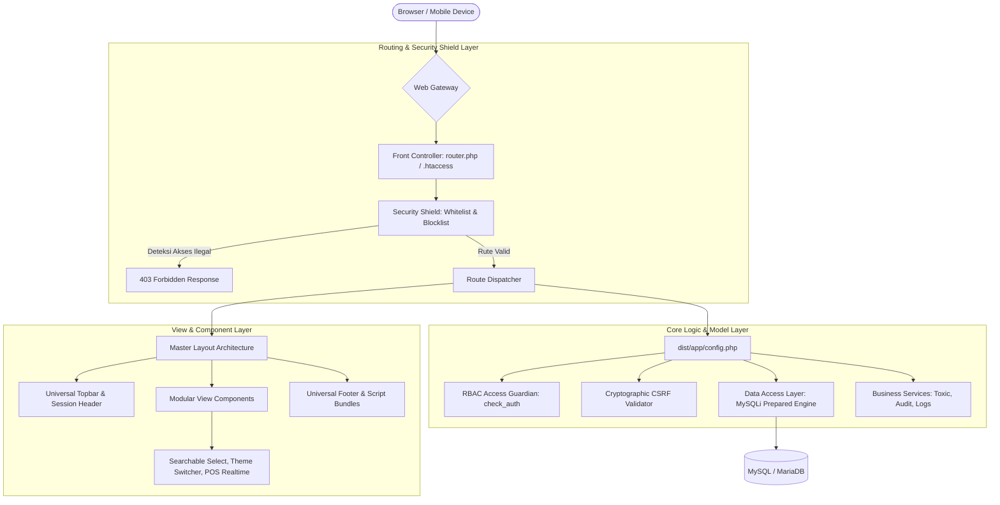
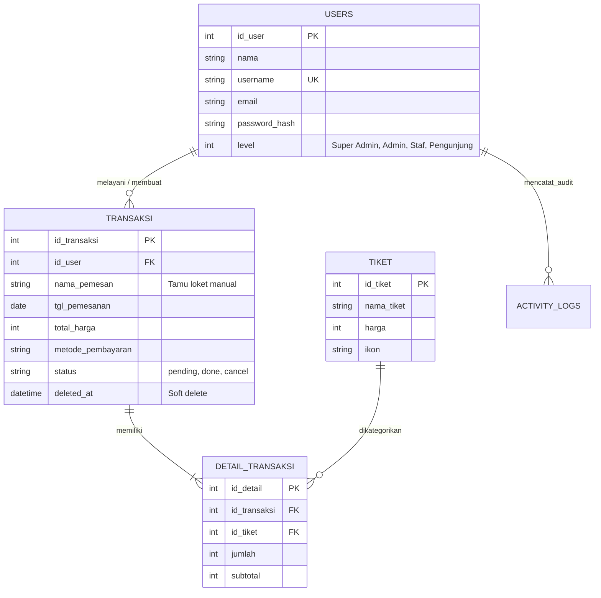

# 🌊 Sistem Informasi Kasir & Reservasi Wisata Pemandian Patemon
### UPTD Pariwisata & Kebudayaan Kabupaten Jember

[](https://php.net)
[](https://mysql.com)
[](https://github.com/Aiyub150/aplikasi-kasir-dan-portofolio-pemandian-patemon)
[](https://github.com/Aiyub150/SIM-ASET)
[](https://github.com/Aiyub150/aplikasi-kasir-dan-portofolio-pemandian-patemon)

---

## 🏛️ 1. Tentang Sistem

**Sistem Informasi & Kasir Loket Pemandian Patemon** adalah platform tata kelola pariwisata terpadu yang dirancang untuk objek wisata mata air alam Patemon di bawah naungan UPTD Pariwisata dan Kebudayaan Pemerintah Kabupaten Jember. 

Platform ini menjembatani dua kebutuhan vital pariwisata modern:
1. **Layanan Publik Digital:** Memperkenalkan daya tarik wisata, fasilitas, dan kemudahan reservasi tiket masuk secara mandiri bagi wisatawan domestik maupun mancanegara.
2. **Tata Kelola Operasional Kasir (POS):** Menyediakan sistem pencatatan transaksi loket fisik yang cepat, akurat, terhindar dari kebocoran retribusi, serta menghasilkan laporan penerimaan kas daerah yang memenuhi standar audit kedinasan.

---

## ✨ 2. Fitur-Fitur Utama Sistem

* **Portal Publik & Portofolio Wisata:** Showcase wahana kolam alami, galeri dokumentasi kegiatan, informasi tarif resmi, formulir ulasan dengan sensor kata terlarang otomatis, serta antarmuka dwibahasa (Indonesia & Inggris).
* **Reservasi & Tiket Digital (E-Ticketing):** Pemesanan mandiri oleh pengunjung dengan opsi pembayaran tunai loket, QRIS dinamis, atau transfer bank, dilengkapi barcode unik Code 128 untuk validasi tiket.
* **Point of Sale (POS) Kasir Loket Cepat:** Formulir kasir cerdas yang mendukung pengunjung langsung (*walk-in guest*) tanpa akun, pemuatan katalog tiket dinamis dari database, live stepper kuantitas, kalkulator uang kembalian instan, dan pencetakan nota transaksi.
* **Pemindaian & Verifikasi Tiket:** Scanner barcode terintegrasi menggunakan kamera perangkat (smartphone/laptop) untuk validasi tiket masuk secara *real-time*.
* **Pelaporan Standar Kedinasan (SIM-ASET Standard):** Laporan penerimaan harian, mingguan, bulanan, dan tahunan yang dilengkapi kop surat resmi dinas Pemkab Jember, konversi angka ke kalimat terbilang rupiah baku, serta lembar pengesahan tanda tangan ganda bertingkat.
* **Dasbor Manajerial & Kalender Wisata:** Statistik omzet, tren volume pengunjung, serta kalender terintegrasi API Hari Libur Nasional (SKB 3 Menteri) untuk proyeksi lonjakan wisatawan saat *high season*.
* **Keamanan Berlapis (Defense-in-Depth):** Proteksi CSRF kriptografis, sanitasi output XSS, query terparameter bebas SQL Injection, proteksi path traversal, pembatasan percobaan login (anti-brute force), audit trail aktivitas, serta log request server real-time.

---

## 📐 3. Pola Arsitektur Sistem

Aplikasi ini dibangun menggunakan arsitektur perangkat lunak berbasis **Front Controller Pattern**, dipadukan dengan konsep **Modular MVC (Model-View-Controller)** yang ramping dan terstruktur:



### Karakteristik Arsitektur:
1. **Front Controller & Clean URL Engine:** Seluruh lalu lintas HTTP diarahkan melalui gerbang tunggal yang memetakan rute ramah pengguna (*clean routes*) ke controller terkait, memblokir berkas sensitif, dan mengisolasi akses berkas bukti transaksi.
2. **Modular View-Controller:** Setiap modul administratif beroperasi secara independen di dalam namespace direktorinya masing-masing dengan tetap mewarisi standar *Master Layout* untuk menjaga konsistensi antarmuka.
3. **Role-Based Access Control (RBAC):** Sistem secara ketat membedakan 4 tingkat wewenang pengguna (*Super Admin*, *Administrator*, *Staf Kasir*, dan *Pengunjung*) pada tingkat gateway dan logika controller.
4. **Data Access Layer Terproteksi:** Seluruh komunikasi ke database diwajibkan melewati mekanisme *parameterized prepared statements* untuk menjamin kekebalan dari manipulasi query SQL.
5. **Universal Component Ecosystem:** Dilengkapi komponen frontend modular tanpa dependensi berat, seperti modul pencarian dropdown interaktif (*Searchable Select*) dan mesin dwibahasa (*i18n engine*).

---

## 🗄️ 4. Model Data & Relasi Entitas

Secara konseptual, struktur data aplikasi terbagi menjadi tiga domain utama:



* **Domain Pengguna & Otorisasi:** Menyimpan data akun pengguna, level wewenang, kredensial terenkripsi aman (*Argon2id/Bcrypt*), log percobaan login, dan riwayat audit trail.
* **Domain Katalog & Transaksi:** Mengelola kategori tiket dinamis, header transaksi penjualan tiket, serta rincian item tiket per transaksi. Mendukung pencatatan tamu loket langsung (*walk-in*) dan penandaan *soft-delete* demi kepatuhan audit kas keuangan.
* **Domain Pemantauan & Moderasi:** Menampung kamus kata terlarang (*toxic words*) untuk sensor otomatis, tabel ulasan publik, serta log performa respon HTTP server.

---

## 💻 5. Panduan Instalasi & Pengaturan Lingkungan (Setup Guide)

### Prasyarat Sistem
* **PHP:** Versi 8.1 ke atas (dengan ekstensi `mysqli`, `curl`, `mbstring`, `fileinfo`, `gd`, `openssl`).
* **Basis Data:** MySQL 8.0+ atau MariaDB 10.4+.
* **Web Server:** Apache dengan modul `mod_rewrite` aktif, Nginx, atau PHP Built-in Server untuk lingkungan pengembangan.
* **Composer:** Opsional (digunakan apabila ingin mengunduh atau memperbarui pustaka vendor).

---

### Langkah-Langkah Pemasangan Lokal

1. **Unduh atau Kloning Repositori:**
   ```bash
   git clone https://github.com/Aiyub150/aplikasi-kasir-dan-portofolio-pemandian-patemon.git
   cd aplikasi-kasir-dan-portofolio-pemandian-patemon
   ```

2. **Inisialisasi Basis Data:**
   * Buat basis data baru bernama `pemandian` melalui phpMyAdmin, DBeaver, atau terminal MySQL.
   * Impor skema resmi yang tersedia pada direktori `database/pemandian.sql`:
     ```bash
     mysql -u root -p pemandian < database/pemandian.sql
     ```

3. **Konfigurasi Koneksi Database:**
   * Buka berkas `dist/app/config.php`.
   * Sesuaikan kredensial server database lokal Anda:
     ```php
     $host = "127.0.0.1";
     $user = "root";
     $pass = "";
     $db   = "pemandian";
     $port = 3306;
     ```

4. **Menjalankan Server Pengembangan Lokal:**
   Gunakan skrip server yang telah dioptimasi dengan routing engine bawaan:
   ```bash
   php serve.php
   ```
   Aplikasi siap diakses melalui peramban web pada alamat: **`http://127.0.0.1:8000`**

---

### Akun Pengujian Bawaan Sistem

| Peran Pengguna | Tingkat Akses | Username | Kata Sandi | Deskripsi Wewenang |
| :--- | :---: | :--- | :--- | :--- |
| **Super Admin** | Level 1 | `super_admin` | `admin123` | Akses penuh, server logs, history audit, kelola seluruh akun. |
| **Administrator** | Level 2 | `admin` | `admin123` | Kelola transaksi, tarif tiket, filter kata kasar, laporan, moderasi. |
| **Staf Kasir** | Level 3 | `staff` | `staff123` | Operasional kasir loket (POS), verifikasi barcode, laporan shift mandiri. |
| **Pengunjung** | Level 0 | `tes` | `admin123` | Reservasi tiket mandiri, unduh struk voucher & barcode QR. |

---

## 🛠️ 6. Panduan Pengembangan & Kustomisasi (Development Workflow)

Bagian ini memandu pengembang dalam memodifikasi, menyesuaikan, atau menambahkan modul baru:

### 1. Kustomisasi Branding & Profil Wisata
* **Identitas & Kontak Objek Wisata:** Informasi nama instansi, alamat, email dinas, dan nomor telepon pengelola diatur secara terpusat pada konstanta konfigurasi di `dist/app/config.php`.
* **Aset Logo & Lambang Kedinasan:** Lambang Pemkab Jember dan logo resmi objek wisata tersimpan pada direktori `public/img/`.
* **Galeri & Banner Utama:** Konten gambar fasilitas dan kolam renang dapat diperbarui melalui modul manajemen galeri di panel admin atau langsung disesuaikan pada file view beranda `dist/views/index.php`.

### 2. Kustomisasi Model Bisnis & Kategori Tiket
* Sistem tidak membatasi jenis tiket. Anda dapat menambahkan tiket musiman, tiket pelajar/mahasiswa, maupun paket rombongan langsung melalui menu **Kategori Tiket** di panel admin.
* Seluruh tiket baru yang ditambahkan otomatis tersedia di antarmuka pemesanan online pengunjung dan modul POS kasir tanpa perlu menulis kode baru.

### 3. Standar Penambahan Halaman / Modul Baru
Saat membuat modul baru di dalam direktori `dist/views/`:
1. **Otorisasi di Baris Pertama:** Selalu panggil fungsi verifikasi hak akses di awal file untuk menentukan siapa yang berhak membuka modul (misal: `check_auth([1, 2]);`).
2. **Gunakan Master Layout:** Bungkus konten halaman menggunakan `admin_header.php` di bagian atas dan `admin_footer.php` di bagian bawah untuk mempertahankan keseragaman tema, bilah navigasi, dan skrip pembantu.
3. **Pendaftaran Rute Bersih:** Daftarkan rute URL bersih baru ke dalam pemetaan router di `router.php` dan buat alias rute pada fungsi helper `route_url()` di `dist/app/config.php`.
4. **Pencegahan CSRF:** Pastikan setiap formulir mutasi data menggunakan metode `POST`, menyertakan token keamanan, dan memvalidasinya sebelum memproses data.

---

## 🚀 7. Panduan Publikasi & Deployment ke Server Produksi (Publishing Guide)

Berikut adalah panduan teknis langkah demi langkah untuk menerbitkan aplikasi ke lingkungan produksi (*Production Web Server*):

### Opsi A: Deployment ke Shared Hosting (cPanel)
1. **Unggah Berkas Proyek:**
   * Kompres seluruh isi folder proyek menjadi arsip `.zip`.
   * Unggah dan ekstrak arsip tersebut ke dalam direktori `public_html` atau subdomain pilihan Anda di cPanel File Manager.
2. **Impor Basis Data:**
   * Buka menu **MySQL Databases** di cPanel, buat basis data baru beserta pengguna database dengan hak akses penuh (*ALL PRIVILEGES*).
   * Buka **phpMyAdmin**, pilih basis data yang baru dibuat, lalu impor berkas `database/pemandian.sql`.
3. **Sesuaikan Konfigurasi Koneksi:**
   * Buka berkas `dist/app/config.php` via editor cPanel, perbarui nama basis data, nama pengguna, dan kata sandi sesuai dengan yang dibuat di langkah sebelumnya.
4. **Verifikasi Web Server Rewrite:**
   * Pastikan berkas `.htaccess` di root direktori telah terunggah dengan benar untuk memastikan pemetaan rute bersih berfungsi sempurna pada Apache/LiteSpeed.

---

### Opsi B: Deployment ke Virtual Private Server (VPS / Cloud Server)
Rekomendasi konfigurasi server produksi menggunakan Ubuntu Server dengan Nginx/Apache:

#### 1. Pengaturan Direktori & Hak Akses Berkas (File Permissions)
Terapkan izin kepemilikan web server (`www-data`) dengan prinsip hak akses terkecil (*least privilege*):
```bash
# Atur kepemilikan ke user web server
sudo chown -R www-data:www-data /var/www/pemandian-patemon

# Direktori standar: 755, Berkas standar: 644
sudo find /var/www/pemandian-patemon/ -type d -exec chmod 755 {} \;
sudo find /var/www/pemandian-patemon/ -type f -exec chmod 644 {} \;

# Berikan izin tulis khusus hanya pada direktori upload bukti pembayaran & avatar
sudo chmod -R 775 /var/www/pemandian-patemon/dist/app/payment
sudo chmod -R 775 /var/www/pemandian-patemon/public/img/avatars
```

#### 2. Konfigurasi Nginx (Virtual Host)
Jika menggunakan Nginx sebagai reverse proxy / web server, gunakan konfigurasi blok server berikut:
```nginx
server {
    listen 80;
    server_name tiket.patemon.jemberkab.go.id;
    root /var/www/pemandian-patemon;
    index dist/views/index.php;

    # Blokir akses publik ke berkas sensitif dan repositori git
    location ~* /\.(env|git|sql|md)$ {
        deny all;
        return 403;
    }

    # Proteksi berkas dependensi dan database dump
    location ~* /(composer\.(json|lock)|database/) {
        deny all;
        return 403;
    }

    # Routing engine fallback
    location / {
        try_files $uri $uri/ /dist/views/index.php?$query_string;
    }

    # Pemrosesan PHP FastCGI
    location ~ \.php$ {
        include snippets/fastcgi-php.conf;
        fastcgi_pass unix:/var/run/php/php8.2-fpm.sock;
        fastcgi_param SCRIPT_FILENAME $document_root$fastcgi_script_name;
        include fastcgi_params;
    }

    # Optimasi Cache untuk Aset Statis
    location ~* \.(css|js|png|jpg|jpeg|gif|ico|svg|woff2)$ {
        expires 30d;
        add_header Cache-Control "public, no-transform";
    }
}
```

#### 3. Penerapan Sertifikat Keamanan SSL/TLS (HTTPS)
Wajib mengaktifkan enkripsi data lalu lintas untuk menjaga kerahasiaan kata sandi dan transaksi:
```bash
sudo certbot --nginx -d tiket.patemon.jemberkab.go.id
```

#### 4. Pengerasan Lingkungan Produksi (Production Hardening Checklist)
* Nonaktifkan penampilan pesan error di layar publik pada lingkungan produksi: pastikan konfigurasi `display_errors = Off` dan `log_errors = On` di `php.ini`.
* Pastikan flag cookie sesi (`session.cookie_secure = 1` dan `session.cookie_httponly = 1`) aktif.
* Jadwalkan backup basis data otomatis secara berkala menggunakan cron job:
  ```bash
  0 2 * * * mysqldump -u db_user -p'db_pass' pemandian | gzip > /var/backups/patemon/db_$(date +\%F).sql.gz
  ```

---

## 📈 8. Rencana Pengembangan Masa Depan (Roadmap)

Sistem dirancang modular untuk mengakomodasi peningkatan skala di masa mendatang:

1. **Integrasi Payment Gateway Otomatis:** Menghubungkan modul pembayaran dengan gateway nasional (seperti Midtrans Snap, Xendit, atau Duitku) untuk otomatisasi verifikasi status lunas tanpa perlu tinjauan bukti transfer manual.
2. **Kios Tiket Mandiri (Self-Service Kiosk):** Antarmuka kasir dapat diintegrasikan dengan layar sentuh (*touchscreen*) loket dan printer termal dispenser tiket di pintu gerbang utama wisata.
3. **Turnstile Gate Integration (Smart Gate IoT):** Menyambungkan scanner barcode dengan mikrokontroler palang pintu otomatis (*turnstile barrier gate*) untuk validasi akses masuk tanpa kontak fisik.
4. **Aplikasi Mobile Petugas:** Pengembangan aplikasi mobile berbasis Android/iOS untuk petugas keamanan dan penjaga kolam guna memantau kapasitas daya tampung pengunjung secara dinamis.

---

## 👨‍💻 9. Kontribusi & Lisensi

* **Pengembang Utama:** [Aiyub150](https://github.com/Aiyub150)
* **Instansi Terkait:** UPTD Pariwisata Pemandian Patemon, Dinas Pariwisata dan Kebudayaan Pemerintah Kabupaten Jember.
* **Lisensi Penggunaan:** Proyek ini masih dibuat open-source dan gratis sehingga instansi manapun bisa menyesuaikan sesuai kebutuhan.
