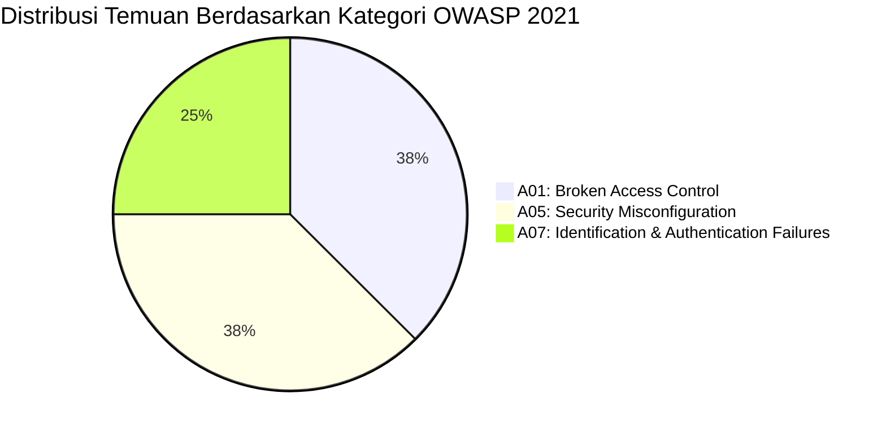

# Security Vulnerability & Standard Compliance Mapping (Re-Audit)
## Project: Pemandian Patemon — Company Profile & Sistem Kasir Loket

**Tanggal:** 2026-09-25  
**Framework Standar Acuan:**
- **OWASP Top 10 (2021)** — Open Web Application Security Project
- **CWE (Common Weakness Enumeration)** — MITRE Corporation
- **CVSS v3.1 (Common Vulnerability Scoring System)**
- **NIST SP 800-53 Rev. 5** — Security and Privacy Controls for Information Systems
- **ISO/IEC 27001:2022** — Information Security Management Controls

---

## 1. Matriks Pemetaan Temuan Keamanan Valid

Berikut adalah pemetaan formal dari seluruh temuan keamanan yang terverifikasi valid pada audit ulang:

| ID Temuan | Nama Kerentanan | OWASP Top 10 (2021) | CWE | CVSS v3.1 Base Score | Tingkat Risiko | Kontrol NIST SP 800-53 | Kontrol ISO 27001:2022 |
|---|---|---|---|---|---|---|---|
| **SEC-01** | Arbitrary File Read / Path Traversal pada `router.php` | A01:2021 – Broken Access Control | CWE-22 | **8.6** (High) | 🔴 HIGH / CRITICAL | AC-3, AC-6, SI-10 | A.8.2, A.8.8 |
| **SEC-02** | Kredensial Bawaan Hardcoded & Dipublikasikan | A07:2021 – Identification & Auth Failures | CWE-798 | **7.5** (High) | 🔴 HIGH | IA-2, IA-5, IA-6 | A.5.17, A.8.5 |
| **SEC-03** | Eksekusi Operasi Hapus via HTTP GET & Token CSRF Bocor di URL | A01:2021 – Broken Access Control / A04:2021 | CWE-598, CWE-352 | **5.4** (Medium) | 🟡 MEDIUM | SC-8, AC-3 | A.8.8, A.8.24 |
| **SEC-04** | Akses Bukti Pembayaran Tanpa Autentikasi | A01:2021 – Broken Access Control | CWE-284, CWE-359 | **5.3** (Medium) | 🟡 MEDIUM | AC-3, SC-28 | A.8.2, A.8.11 |
| **SEC-05** | Ketiadaan Rate Limiting & Proteksi Brute Force pada Login | A07:2021 – Identification & Auth Failures | CWE-307 | **5.3** (Medium) | 🟡 MEDIUM | AC-7, SC-5 | A.8.5, A.8.26 |
| **SEC-06** | Cookie Sesi Tanpa Atribut Keamanan `Secure` & `SameSite` | A05:2021 – Security Misconfiguration | CWE-614, CWE-1275 | **4.3** (Low) | 🟢 LOW | SC-13, SC-23 | A.8.8, A.8.20 |
| **SEC-07** | Information Disclosure Melalui Pesan Error Basis Data | A05:2021 – Security Misconfiguration | CWE-209 | **3.7** (Low) | 🟢 LOW | SI-11 | A.8.8 |
| **SEC-08** | Ketiadaan Proteksi Directory Listing & Security Headers di `.htaccess` | A05:2021 – Security Misconfiguration | CWE-548, CWE-693 | **3.7** (Low) | 🟢 LOW | CM-6, CM-7 | A.8.9, A.8.20 |

---

## 2. Matriks Status Validasi Temuan (Valid vs False Positive)

Tabel berikut menyandingkan status temuan audit terdahulu dengan hasil audit ulang saat ini:

| ID Audit Lama | Deskripsi Temuan Awal | Status Audit Ulang | Alasan & Evaluasi Teknis |
|---|---|---|---|
| *VUL-01* | IDOR pada Nota Transaksi (`nota.php`) | ❌ **TIDAK VALID (False Positive)** | Parameter `$user_lvl = 0` (pengunjung) menghasilkan kondisi `0 = 1 OR 0 = 2 OR 0 = 3` yang seluruhnya `FALSE`. Query hanya mencocokkan `transaksi.id_user = $id_user` sendiri. Pengunjung level 0 tidak dapat mengakses nota milik pengunjung lain. |
| *VUL-02* | CSRF Token Dikirim via GET pada Delete | ⚠️ **DIREKLASIFIKASI (SEC-03)** | Token CSRF sebenarnya diverifikasi (`validate_csrf`), namun metode GET melanggar standar HTTP dan menyebabkan token bocor melalui server log & header `Referer` (CWE-598). |
| *VUL-03* | Plaintext Password di Kode Sumber (`serve.php`) | ✅ **VALID (Digabung ke SEC-02)** | Kredensial default admin dan staff dicetak ke console dan tersimpan di repositori Git. |
| *VUL-04* | Session Cookie Tanpa Flag Secure | ✅ **VALID (SEC-06)** | Cookie belum memiliki atribut `Secure` dan `SameSite`. |
| *VUL-05* | Tidak Ada Rate Limiting pada Login | ✅ **VALID (SEC-05)** | Tidak ada pembatasan jumlah percobaan login gagal. |
| *VUL-06* | Error Message Bocorkan Info Teknis | ✅ **VALID (SEC-07)** | Nama database dan engine error MySQL terpapar ke pengguna. |
| *VUL-07* | Fitur Forgot Password Tidak Fungsional | ❌ **BUKAN KERENTANAN KEAMANAN** | Menampilkan pesan generik adalah standar anti-user enumeration. Ketiadaan pengiriman email adalah fungsionalitas yang belum selesai (*feature stub*), bukan celah eksploitasi. |
| *VUL-08* | Path Traversal di Payment File Serving | ✅ **VALID & ESKALASI RISIKO (SEC-01)** | Risiko ditingkatkan menjadi **CRITICAL/HIGH** karena terbukti mampu membaca `dist/app/config.php` (kredensial DB) dan melintasi struktur folder pada Windows. |
| *VUL-09* | Credentials Default Terpublikasi di SQL | ✅ **VALID (Digabung ke SEC-02)** | Seed akun default menggunakan hash yang sama dan terdokumentasi di repositori. |
| *VUL-10* | Inkonsistensi RBAC Staf vs Admin Route | ❌ **BUKAN KERENTANAN KEAMANAN** | Penolakan akses kasir ke `tambah.php` bersifat *fail-closed* (membatasi akses), bukan *fail-open* (tidak ada bypass izin). |

---

## 3. Distribusi OWASP Top 10 (2021)

1. **A01:2021 — Broken Access Control (3 Temuan)**
   - SEC-01: Path Traversal pada penanganan file payment
   - SEC-03: Operasi penghapusan data tanpa proteksi HTTP POST
   - SEC-04: Akses tidak terotentikasi ke file bukti pembayaran
2. **A05:2021 — Security Misconfiguration (3 Temuan)**
   - SEC-06: Konfigurasi cookie sesi kurang ketat
   - SEC-07: Tampilan pesan galat sistem basis data
   - SEC-08: Ketiadaan direktif pencegahan directory listing di server web
3. **A07:2021 — Identification and Authentication Failures (2 Temuan)**
   - SEC-02: Kredensial bawaan yang tidak diubah
   - SEC-05: Ketiadaan mekanisme proteksi brute-force login

---

## 4. Evaluasi Postur Pertahanan yang Sudah Baik (*Defensive Strengths*)

Audit juga mengonfirmasi adanya praktik keamanan yang telah diterapkan dengan sangat baik oleh pengembang:

1. **Prepared Statement Menyeluruh:**
   Hampir seluruh query dinamis menggunakan `mysqli::prepare()` dengan *type binding* ketat (`bind_param`), sehingga aplikasi **terproteksi dengan baik dari serangan SQL Injection (SQLi)**.
2. **Hasing Kata Sandi Modern:**
   Menggunakan algoritma `PASSWORD_BCRYPT` dengan cost standar PHP modern dan auto-rehash migrasi kata sandi pada modul login.
3. **Validasi File Upload Dua Lapis:**
   Pada modul `pesan.php` dan `gallery.php`, pemeriksaan file unggahan memverifikasi ekstensi file (`in_array($ext, ...)`), ukuran maksimal file, dan validasi MIME-type riil melalui `finfo_file()`.
4. **Pencegahan Stored XSS Konsisten:**
   Penyajian data dinamis ke layar HTML secara konsisten menggunakan helper `e()` (`htmlspecialchars` dengan flag `ENT_QUOTES` dan encoding `UTF-8`).
5. **Regenerasi ID Sesi:**
   Fungsi `session_regenerate_id(true)` dipanggil tepat saat login berhasil, mencegah serangan *Session Fixation*.
6. **Blokir File Sensitif di Root:**
   Skrip `router.php` dan file `.htaccess` telah memblokir akses langsung ke file berekstensi `.env`, `.git`, `.sql`, dan direktori `database/`.

---

## 5. Rencana Aksi Remediasi Berdasarkan Prioritas (*Action Plan*)

### Tahap 1: Tindakan Segera (Critical & High — 24–48 Jam Pertama)
- [ ] **Patch `router.php`:** Terapkan pembersihan path menggunakan `basename()` dan verifikasi `realpath()` terhadap direktori `dist/app/payment/` untuk menutup celah Arbitrary File Read.
- [ ] **Reset Kredensial Default:** Ganti kata sandi `admin`, `superadmin`, dan `staff` di basis data produksi dengan kata sandi unik dan kuat. Hapus echo kredensial pada `serve.php`.

### Tahap 2: Tindakan Jangka Pendek (Medium — 1 Minggu)
- [ ] **Refactoring Endpoint Hapus:** Ubah pemanggilan `delete.php` pada transaksi, tiket, ulasan, dan pengguna agar menggunakan metode HTTP `POST` dengan token CSRF di request body.
- [ ] **Restriksi File Pembayaran:** Tambahkan pengecekan otorisasi sesi sebelum menyajikan file bukti pembayaran pada `/app/payment/`.
- [ ] **Rate Limiting Login:** Tambahkan penghitung kegagalan login pada tabel sesi atau cache untuk memblokir IP setelah 5 kali salah password.

### Tahap 3: Tindakan Jangka Menengah (Low / Hardening — 2 Minggu)
- [ ] **Pengerasan Cookie Sesi:** Aktifkan `session.cookie_secure` (saat HTTPS aktif) dan `session.cookie_samesite = 'Lax'` pada `config.php`.
- [ ] **Pemberian Header Keamanan:** Tambahkan `Options -Indexes`, `X-Content-Type-Options: nosniff`, dan `X-Frame-Options: SAMEORIGIN` pada `.htaccess`.
- [ ] **Standardisasi Error Handling:** Alihkan pesan kesalahan MySQL teknis ke log internal `error_log()` dan sajikan pesan ramah bagi pengguna awam.
